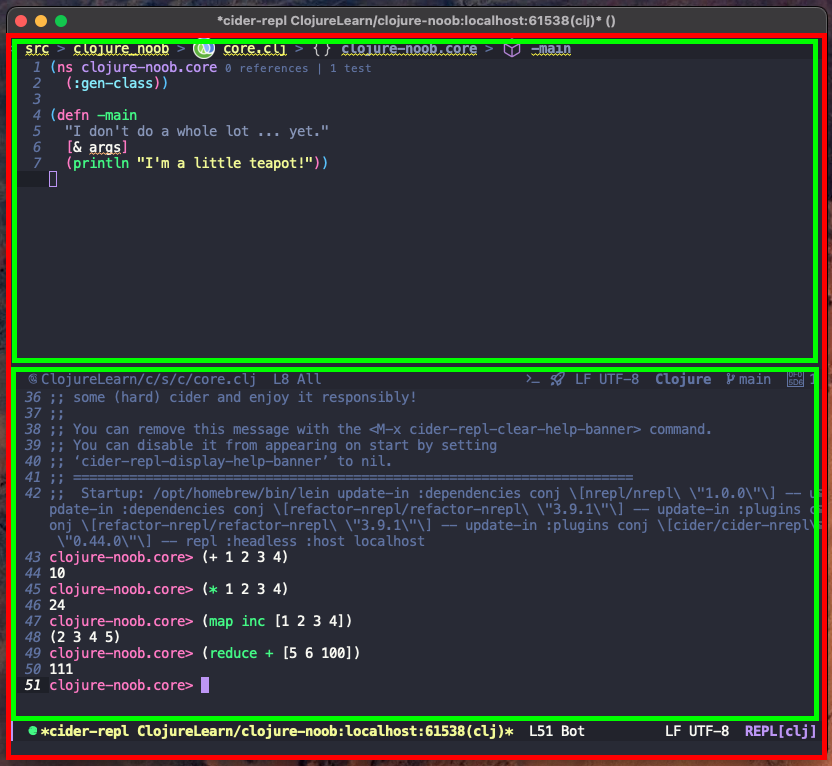

# Learning Clojure

## Clojure Basics

(notes taken from: https://www.braveclojure.com/getting-started/)

Clojure projects are usually managed and built using Leiningen: http://leiningen.org/. Java is required, OpenJDK is recommended, as is using an LTS version.

Clojure itself is not required when using Leiningen, as it will pull down all required files including Clojure.

Clojure has an LSP: clojure-lsp

On Mac and Linux both Leiningen and clojure-lsp can be installed using Brew.

Leiningen is invoked with the `lein` command.

Creating a new project is done using: `lein new app <app-name>`. The app name you use will create a project directory of that name.

Once the project is created there is a basic 'Hello, world!' program ready to go.

`cd` into the project directory and run the app by executing `lein run`.

The 'Hello, world!' program is a full, valid app. It only prints a string to the screen but this can be packaged and distributed as it is. As Clojure apps run on the JVM we compile to bytecode and package this in a JAR file.

To do this we run `lein uberjar`, which will produce a `target` directory and two JAR files:

- `<app-name>-0.1.0-SNAPSHOT.jar`, and;
- `<app-name>-0.1.0-SNAPSHOT-standalone.jar`

The standalone JAR can be shared and run on any computer with the JVM with no other Clojure tools.

This is run by executing: `java -jar /path/to/<app-name>-0.1.0-SNAPSHOT-standalone.jar`.

One of Clojure's best features is it's REPL, this can be invoked by executing: `lein repl`.

Running this within a project directory sets the REPL's default namespace to that of the project, so you can call functions from the project directly in the REPL. This is very useful for experimenting with how functions work and prototyping functionality against an existing codebase.

As an example, when using the REPL within a default new app project we can invoke the `-main` function like this:

```
<app-name>.core=> (-main)
Hello, world!
```

(`<app-name>.core=>` is the default prompt of the REPL when run within our project directory, reflecting our namespace.)

## Emacs Basics

(notes taken from: https://www.braveclojure.com/basic-emacs/)

---
### Settings up Emacs

The book recommends downloading a zip file with customisations but I have found this to have errors, instead do the following from ~:

```
rm -rf .emacs*
git clone https://github.com/flyingmachine/emacs-for-clojure.git
mv emacs-for-clojure .emacs.d
cd .emacs.d
rm -rf .git*
```

Then open Emacs and let it run through it's initial setup for a few minutes (until the download and setup has stopped), after which quit and re-open it.

---

(**C-** indicates the **Ctrl** should be held while pressing the accompanying key, for example **C-x** means Hold **Ctrl** and press **x**)

- C-x b     switch to or create a buffer (by entering a buffer name)
- C-x k     kill a buffer, the existing buffer by default or another buffer by buffer name
- C-x C-f   open a file, or create a new file
- C-x C-s   save a file

Emacs is Lisp interpreter, specifically Emacs uses `elisp`, and it exposes multiple functions written in that Lisp dialect as functions bound to keystrokes and keystroke combinations, these are exposed in such a way that Emacs functions as an editor.

It's possible to change Emacs' functions and key bindings, even while Emacs is running.

Functions are bound to keystrokes and keystroke combinations using a lookup table within Emacs, like everything else this can be changed. This lookup table simply pars keystrokes and combinations to an internal function, and the functions can be invokes directly using **M-x** (**M** is the "meta" key, this is typically the _alt_ key on Windows/Linux systems and the _option_ key on a Mac) which will prompt you for the name of a function to run.

Emacs operated in "modes" which allow for differing syntax highlighting and keystroke combinations for different workloads. For example, a Markdown mode would be better suited to working with Markdown documents, and a Clojure mode would offer Clojure syntax highlighting and access to Clojure-specific features like the REPL.

**From: https://github.com/clojure-emacs/clojure-mode/:**

You can install `clojure-mode` using the following command: `[M-x] package-install [RET] clojure-mode [RET]`

Emacs modes come as major modes and minor modes.

Major modes specialise Emacs for specific languages or project types, and only one major mode can be enabled at a time, so Clojure mode would enforce functions across all buffers specific to working with the Clojure language.

Minor modes allow for more generic functionality to be enabled in Emacs, including alongside a major mode being active, and multiple minor modes can be active at a time.

- C-k   delete everything from the point to the end of the line
- C-/   undo the last change

### Movement

- C-a	Move to beginning of line.
- M-m	Move to first non-whitespace character on the line.
- C-e	Move to end of line.
- C-f	Move forward one character.
- C-b	Move backward one character.
- M-f	Move forward one word (I use this a lot).
- M-b	Move backward one word (I use this a lot, too).
- C-s	Regex search for text in current buffer and move to it. Press C-s again to move to next match.
- C-r	Same as C-s, but search in reverse.
- M-<	Move to beginning of buffer.
- M->	Move to end of buffer.
- M-g g	Go to line.

### Selection and Regions

Regions of text can be selected with **C-space**, pairing this with any of the movement options allows Emacs to select large region of ext quickly and efficiently.

### Killing, the Kill Ring and Yanking

Emacs doesn't use the standard cut/copy/past paradigm that your OS employs, instead Emacs kills selected text and can store multiple blocks of killed text on the kill ring.

- C-w	Kill region.
- M-w	Copy region to kill ring --- COPY
- C-y	Yank --- PASTE
- M-y	Cycle through kill ring after yanking.
- M-d	Kill word --- CUT THE CURRENT WORD
- C-k	Kill line.

### Editing and Help

- Tab	Indent line.
- C-j	New line and indent, equivalent to enter followed by tab.
- M-/	Hippie expand; cycles through possible expansions of the text before point.
- M-\	Delete all spaces and tabs around point. (I use this one a lot.)
- C-h k key-binding	Describe the function bound to the key binding. To get this to work, you actually perform the key sequence after typing C-h k.
- C-h f	Describe function.

## Using Emacs with Clojure

CIDER is a package that allows the Clojure REPL to run within Emacs: https://github.com/clojure-emacs/cider/

Install it by running `[M-x] package-install [rtn] cider [rtn]`.

Open a Clojure source file and point Emacs to the project root directory, then open the REPL by running `[M-x] cider-jack-in [rtn]`.

This will open up a second "window" in which the REPL will run within the overall Emacs "frame", the terminology here is a bit confusing as it's somewhat counter to modern terminology:



Here, the red section is the frame (note this does not include the actual application window), and the green sections are the individual windows - one for our Clojure source file and another for the REPL.

- C-x o	Switch cursor to another window. Try this now to switch between your Clojure file and the REPL.
- C-x 1	Delete all other windows, leaving only the current window in the frame. This doesn’t close your buffers, and it won’t cause you to lose any work.
- C-x 2	Split frame above and below.
- C-x 3	Split frame side by side.
- C-x 0	Delete current window.

### Clojure-specific Key Bindings

- C-x C-e   runs the `cider-eval-last-expression` function
- C-u C-x C-e   also prints the result of the evaluation after the point
- C-c M-n M-n   sets the namespace in the REPL to that of our source file
- C-up/C-down   cycle through the REPL history (this conflicts with system keybinds on Mac)
- C-rtn used in the REPL will add the closing parentheses and execute the expression or function call
- C-c C-d C-d   displays documentation for the symbol under the point (q to close this)
- M-minus   navigates to the source code of the symbol under the point, a second time returns to the original buffer and position
- C-c C-d C-a   searches across function names and documentation

### Handling Errors

An error in the REPL will produce a stack trace, press C-x o to switch to the error windows and press q to close it.

If an error existing in your source file when you save it, it too will produce a stack trace, again pressing q while in the stack trace window will close it.

### Paredit

Paredit is an Emacs minor mode that ensures all opened parentheses, double quotes and brackets are automatically closed.

Paredit has a number of key bindings for allowing us to easily navigate and alter the structure of our parentheses. A full cheat sheet can be found here: https://github.com/georgek/paredit-cheatsheet/blob/master/paredit-cheatsheet.pdf

- M-x paredit-mode  enable/disable paredit mode in Emacs
- M-( (M-shift+9)   creates a parentheses for wrap around, we can add a symbol and the use C-right to extend the wrap around right

For example, we can turn `(+ 1 2 3 4)` into `(+ 1 (* 2 3) 4)` by using the wrap around key binding. If we extend the wrap around too far we can pull back the closing parentheses with C-left.

- C-M-f move to the opening parentheses
- C-M-b move to the closing parentheses

Emacs reference card: http://www.ic.unicamp.br/~helio/disciplinas/MC102/Emacs_Reference_Card.pdf

- C-h t opens Emacs built-in tutorial

